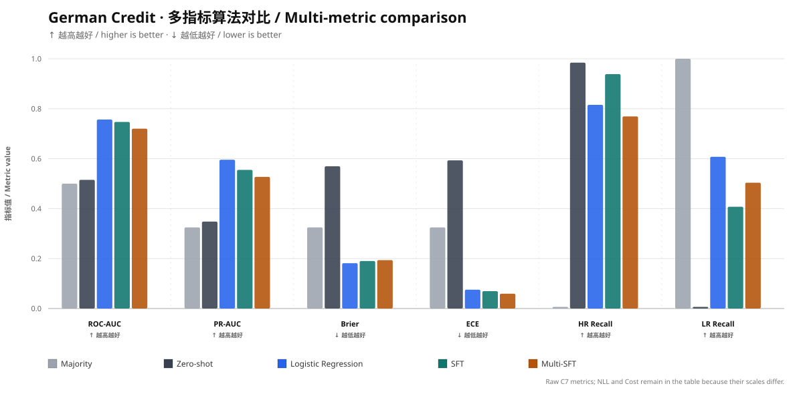

# Risk-Control Post-Training for Large Language Models

<p align="center">
  <a href="./README.md">中文</a>
  &nbsp;·&nbsp;
  <a href="./README.en.md"><strong>English</strong></a>
  &nbsp;·&nbsp;
  <a href="https://urgencywu.github.io/risk-control-posttraining/"><strong>Live Interactive Showcase</strong></a>
</p>

## Project Summary

This project asks: **can post-training make a compact instruction-tuned LLM learn useful sample-level risk ranking on small structured credit data, and does that value hold against a strong statistical baseline?**

The study uses `Qwen3.5-4B` and German Credit as the primary setting, with Australian Credit for multi-dataset validation. It covers data governance, LoRA SFT, DPO/SimPO, cost-sensitive decisions, leakage-safe evaluation, and mechanism-level failure analysis.

| Core finding | Frozen result | Claim boundary |
|---|---:|---|
| LoRA SFT learns useful ranking | ROC-AUC `0.515 → 0.747`, a **+0.232** gain | Materially improves zero-shot |
| The statistical baseline remains slightly stronger | Logistic Regression `0.757` vs SFT `0.747` | Competitive, not stably superior |
| Cost-sensitive operating points matter | best SFT Cost `100`, LR `113`, zero-shot `140` | Three-seed SFT mean Cost is `123 ± 16` |
| Label-level preference optimization reaches a boundary | **6 / 6** principal DPO/SimPO runs fail to exceed SFT | Limited to the tested small-data, tabular, short-label setting |

This repository is an independent extension of the open-source [CALM](https://github.com/Dai-shen/CALM) project and does not claim authorship of the original CALM paper, model, benchmark, or datasets.

## Research Questions

1. Can an instruction-tuned LLM learn generalizable ranking from natural-language tabular records?
2. Can LoRA SFT improve ranking, probability quality, and asymmetric cost simultaneously?
3. Can DPO/SimPO optimize risk preferences without destroying sample-level ranking?
4. Are failures caused by data, optimization, thresholds, or objective-task mismatch?

## Technical Route

```text
Audit CALM data and repository
        ↓
Define unified RiskDataset schema and labels
        ↓
Create deterministic Normalized / ChatML data
        ↓
Build Majority / Logistic Regression / Qwen Zero-shot baselines
        ↓
Run three-seed Qwen3.5-4B LoRA SFT
        ↓
Construct Oracle / Hard preference pairs
        ↓
Run DPO / SimPO / cost-sensitive controls
        ↓
Freeze validation thresholds + C7 evaluation + log-probability audit
```

Training produces risk scores; business thresholds are selected only on validation predictions under `Cost = 5 × FN + 1 × FP` and then frozen for test evaluation.

## Implementation Details

### 1. Data and reproducibility

- German Credit: 1,000 records and 20 features, frozen to `700/100/200` with seed `10086`;
- German–Australian: `1182/169/339` train/validation/test records;
- Normalized, ChatML SFT, Preference, and Evaluation layers;
- manifest, schema, V1–V7, and repeated SHA-256 checks.

### 2. Model and training roles

| Model or checkpoint | Role | Status |
|---|---|---|
| Majority | Class-imbalance lower bound | Verified |
| Logistic Regression | Strong non-LLM baseline | Verified |
| Qwen3.5-4B Zero-shot | Unadapted LLM baseline | Verified |
| Qwen3.5-4B LoRA SFT, seeds `10086/42/7` | Primary post-training | Verified |
| German–Australian Multi-SFT | Transfer experiment | Negative transfer on German |
| DPO / SimPO | Preference stress test | Run; target not achieved |
| Cost-sensitive / Anchored / Risk-DPO | Weighting and anchoring controls | Failed, incomplete, or terminated |

SFT uses response-only causal-LM loss, LoRA `r=16`, `alpha=32`, `dropout=0.05`, five epochs, and `2 × RTX PRO 6000 Blackwell` GPUs.

### 3. Preference data and evaluation

- German oracle preference: 800 pairs; German hard preference: 361 pairs;
- German–Australian hard preference: 549 training and 81 validation records;
- unified Accuracy, Balanced Accuracy, Macro-F1, Recall, ROC-AUC, PR-AUC, NLL, Brier, ECE, confusion matrices, and asymmetric Cost;
- test labels never participate in threshold search.

## Experimental Data

### Grouped multi-metric bar chart



The chart compares six common `0–1` metrics: `ROC-AUC`, `PR-AUC`, `Brier`, `ECE`, high-risk recall, and low-risk recall. Every metric group contains all five algorithms. Exact `NLL` and `Cost` values remain in the table.

### German Credit test set, N = 200

| Model | ROC-AUC | PR-AUC | NLL | Brier | ECE | Cost | High-risk recall | Low-risk recall |
|---|---:|---:|---:|---:|---:|---:|---:|---:|
| Majority | 0.500 | 0.325 | 8.980 | 0.325 | 0.325 | 325 | 0.000 | 1.000 |
| Qwen3.5-4B Zero-shot | 0.515 | 0.348 | 1.720 | 0.570 | 0.593 | 140 | 0.985 | 0.000 |
| **Logistic Regression** | **0.757** | **0.596** | **0.552** | **0.182** | 0.076 | 113 | 0.815 | 0.607 |
| Qwen3.5-4B SFT seed 7 | 0.747 | 0.555 | 0.556 | 0.190 | 0.070 | **100** | 0.939 | 0.407 |
| Qwen3.5-4B Multi-SFT, German subset | 0.720 | 0.527 | 0.568 | 0.194 | **0.059** | 142 | 0.769 | 0.504 |

### Three-seed SFT stability

| Metric | Mean ± standard deviation |
|---|---:|
| Accuracy | `0.620 ± 0.04` |
| ROC-AUC | `0.747 ± 0.01` |
| High-risk recall | `0.821 ± 0.08` |
| Test Cost under validation-selected thresholds | `123 ± 16` |

### Six principal DPO/SimPO experiments

| Experiment | ROC-AUC | Decision behavior or Cost | Outcome |
|---|---:|---|---|
| German Oracle DPO | 0.706 | Cost 325; all low risk | Below SFT |
| German Oracle SimPO | 0.500 | Cost 325; random-level ranking | Below SFT |
| German Hard DPO | 0.478 | Cost 139; below-random ranking | Below SFT |
| German Hard SimPO | 0.504 | Cost 135; random-level ranking | Below SFT |
| Multi-dataset DPO | German 0.517; Australian 0.666 | 100% high-risk decisions | Below SFT |
| Multi-dataset SimPO | German 0.525; Australian 0.648 | 100% high-risk decisions | Below SFT |

[`outputs/c7_final_metrics.json`](./outputs/c7_final_metrics.json) is the source of truth.

## Experimental Conclusions

1. **SFT is the only post-training method that consistently creates useful ranking.** ROC-AUC rises from `0.515` to `0.747`.
2. **Logistic Regression remains the strongest ranking and probability baseline.** `0.757` exceeds SFT's `0.747`; stable superiority is not claimed.
3. **Cost-sensitive thresholds help but do not replace ranking.** AUC and calibration expose trivial all-high-risk behavior.
4. **Label-level DPO/SimPO is misaligned with sample-level ranking in this setting.** Preference loss mainly shifts the global label prior.
5. **The conclusion is bounded to this setting.** It is not generalized to all DPO/SimPO tasks.

## Reproduction Guide

### 1. Reproduce frozen metrics on CPU

```bash
git clone https://github.com/UrgencyWu/risk-control-posttraining.git
cd risk-control-posttraining
python -m venv .venv
source .venv/bin/activate
python -m pip install -r requirements-eval.txt
python -m unittest discover -s tests -v
python -m src.evaluation.c7_final --output /tmp/c7_final_metrics.json
cmp outputs/c7_final_metrics.json /tmp/c7_final_metrics.json
```

### 2. Run the GPU workflow

```bash
python -m pip install -r requirements-train.txt
export RISK_CONTROL_MODEL_ID=/absolute/path/to/Qwen3.5-4B
sbatch scripts/sft_slurm.sh
sbatch scripts/dpo_train.sh
sbatch scripts/simpo_train.sh
```

- Live site: <https://urgencywu.github.io/risk-control-posttraining/>
- Showcase notes: [`docs/SHOWCASE.md`](./docs/SHOWCASE.md)

---

For research, education, and portfolio use only; not for high-impact decisions. See [`NOTICE`](./NOTICE) and [`LICENSE`](./LICENSE).
