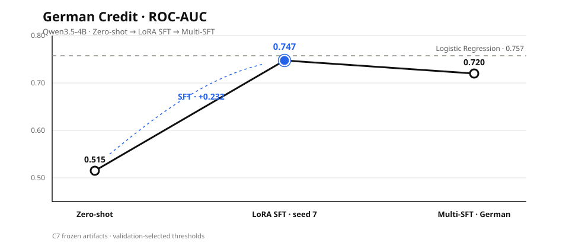

# 大语言模型风控后训练

<p align="center">
  <a href="./README.md"><strong>中文</strong></a>
  &nbsp;·&nbsp;
  <a href="./README.en.md">English</a>
  &nbsp;·&nbsp;
  <a href="https://urgencywu.github.io/risk-control-posttraining/"><strong>在线交互展示</strong></a>
</p>

## 项目摘要

本项目研究一个具体问题：**在小样本、结构化信用风险任务中，大语言模型后训练能否形成有效的样本级风险排序，并在强传统模型基线面前体现实际价值。**

项目以 `Qwen3.5-4B`、German Credit 为主实验对象，使用 Australian Credit 进行多数据集验证，完整覆盖数据治理、LoRA SFT、DPO/SimPO、成本敏感决策、无测试泄漏评测与失败机制审计。

| 核心发现 | 冻结结果 | 结论边界 |
|---|---:|---|
| LoRA SFT 学到有效风险排序 | ROC-AUC `0.515 → 0.747`，提升 **+0.232** | SFT 显著优于零样本模型 |
| 强传统模型仍略优 | Logistic Regression `0.757` vs SFT `0.747` | 项目声称“接近”，不声称稳定超越 |
| 成本敏感阈值具有实际作用 | 最佳 SFT Cost `100`，LR `113`，零样本 `140` | 三随机种子 SFT 平均 Cost 为 `123 ± 16`，不能以单次结果替代稳定性结论 |
| 标签级偏好优化出现方法边界 | **6 / 6** 组主 DPO/SimPO 实验未超过 SFT | 负结果限定于当前小样本、表格数据、二标签短回答设定 |

本仓库是开源 [CALM](https://github.com/Dai-shen/CALM) 项目的独立扩展。CALM 提供原始任务背景与公开数据；本项目围绕 `Qwen3.5-4B` 重建实验链路，不主张拥有原始 CALM 论文、模型、基准或数据集的作者身份。

## 研究问题

1. 指令模型能否从自然语言形式的表格信用记录中学习可泛化的风险排序？
2. LoRA SFT 能否同时改善 ROC-AUC、概率质量和非对称业务成本？
3. DPO/SimPO 是否能够在不破坏样本级排序的前提下进一步优化风险偏好？
4. 当后训练失败时，根因来自数据、优化稳定性、阈值选择，还是目标函数与任务形式的错配？

## 技术路线

```text
CALM 原始数据与仓库审计
        ↓
统一 RiskDataset Schema 与标签语义
        ↓
确定性划分 + Normalized / ChatML 数据
        ↓
Majority / Logistic Regression / Qwen Zero-shot 基线
        ↓
Qwen3.5-4B LoRA SFT（三随机种子）
        ↓
Oracle / Hard Preference 构造
        ↓
DPO / SimPO / Cost-sensitive / Anchored Pilot
        ↓
验证集冻结阈值 + C7 最终评测 + Log-probability 审计
```

技术路线将**表示学习**与**决策 operating point**分离：模型训练负责形成风险分数，业务阈值只在验证集上按照 `Cost = 5 × FN + 1 × FP` 选择，再固定应用到测试集。

## 实施细节

### 1. 数据与可复现性

- 审计 10 个金融风控数据集，覆盖信用评分、欺诈检测、财务困境与理赔分析；
- 统一 `risk_label`、`task_type`、`target_type` 与 `original_label`，保留标签来源与业务语义；
- German Credit 共 1,000 条记录、20 个特征，按照 seed `10086` 冻结为 `700/100/200`；
- German–Australian 合并数据包含 `1182/169/339` 条 train/valid/test 记录；
- 输出 Normalized、ChatML SFT、Preference 与 Evaluation 多层数据；
- 使用 manifest、Schema 检查、V1–V7 校验与重复 SHA-256 验证保证确定性。

### 2. 模型与训练角色

| 模型或 Checkpoint | 实验角色 | 状态 |
|---|---|---|
| Majority | 类别不平衡下界 | 已实现并验证 |
| Logistic Regression | 强非 LLM 基线 | 已实现并验证 |
| Qwen3.5-4B Zero-shot | 未适配 LLM 基线 | 已实现并验证 |
| Qwen3.5-4B LoRA SFT，seeds `10086/42/7` | 主后训练实验 | 已实现并验证 |
| SFT seed `7` | 按验证集 PR-AUC 规则冻结的下游 Checkpoint | 已实现并验证 |
| German–Australian Multi-SFT | 多数据集迁移实验 | 已实现并验证，German 上存在负迁移 |
| DPO / SimPO | 标签级偏好优化压力测试 | 已运行，未达目标 |
| Cost-sensitive SFT / Anchored DPO / Risk-DPO | 成本加权与锚定对照 | 失败、未完成或终止 |

SFT 使用 response-only causal-LM loss，LoRA `r=16`、`alpha=32`、`dropout=0.05`，覆盖 attention 与 MLP projection，训练 5 个 epoch，并在 `2 × RTX PRO 6000 Blackwell` 上完成多随机种子实验。

### 3. 偏好数据与优化

- German oracle preference：800 对；
- German hard preference：361 对，由 SFT 排序错误与低置信样本构造；
- German–Australian hard preference：549 条训练、81 条验证；
- 六组主实验覆盖 oracle/hard、单数据集/多数据集、DPO/SimPO；
- 额外执行 Cost-sensitive SFT、Anchored DPO 与 Risk-DPO Pilot，用于验证成本权重和 SFT 锚定是否能够避免退化。

### 4. 评测协议

统一评测包含 Accuracy、Balanced Accuracy、Macro-F1、High-/Low-risk Recall、ROC-AUC、PR-AUC、NLL、Brier、ECE、混淆矩阵与非对称 Cost。

```text
Cost = 5 × False Negative + 1 × False Positive
```

C7 只从已提交的验证预测中选择阈值，再将冻结阈值应用到对应测试预测；测试标签不参与阈值搜索。完整协议见 [`docs/EVALUATION_PROTOCOL.md`](./docs/EVALUATION_PROTOCOL.md)。

## 实验数据

### ROC-AUC 路线折线图



### German Credit 测试集，N = 200

| 模型 | ROC-AUC | PR-AUC | NLL | Brier | ECE | Cost | 高风险召回 | 低风险召回 |
|---|---:|---:|---:|---:|---:|---:|---:|---:|
| Majority | 0.500 | 0.325 | 8.980 | 0.325 | 0.325 | 325 | 0.000 | 1.000 |
| Qwen3.5-4B Zero-shot | 0.515 | 0.348 | 1.720 | 0.570 | 0.593 | 140 | 0.985 | 0.000 |
| **Logistic Regression** | **0.757** | **0.596** | **0.552** | **0.182** | 0.076 | 113 | 0.815 | 0.607 |
| Qwen3.5-4B SFT seed 7 | 0.747 | 0.555 | 0.556 | 0.190 | 0.070 | **100** | 0.939 | 0.407 |
| Qwen3.5-4B Multi-SFT（German 子集） | 0.720 | 0.527 | 0.568 | 0.194 | **0.059** | 142 | 0.769 | 0.504 |

### SFT 三随机种子稳定性

| 指标 | 均值 ± 标准差 |
|---|---:|
| Accuracy | `0.620 ± 0.04` |
| ROC-AUC | `0.747 ± 0.01` |
| 高风险召回 | `0.821 ± 0.08` |
| 验证集阈值下测试 Cost | `123 ± 16` |

### 六组主 DPO/SimPO 实验

| 实验 | ROC-AUC | 决策行为或 Cost | 结果 |
|---|---:|---|---|
| German Oracle DPO | 0.706 | Cost 325；全部预测 low risk | 未超过 SFT |
| German Oracle SimPO | 0.500 | Cost 325；随机水平 | 未超过 SFT |
| German Hard DPO | 0.478 | Cost 139；排序低于随机 | 未超过 SFT |
| German Hard SimPO | 0.504 | Cost 135；随机水平 | 未超过 SFT |
| Multi-dataset DPO | German 0.517；Australian 0.666 | 100% high-risk 决策 | 未超过 SFT |
| Multi-dataset SimPO | German 0.525；Australian 0.648 | 100% high-risk 决策 | 未超过 SFT |

最终指标以 [`outputs/c7_final_metrics.json`](./outputs/c7_final_metrics.json) 为权威来源，完整实验历史见 [`docs/Progress_Report.md`](./docs/Progress_Report.md)。

## 实验结论

1. **SFT 是唯一稳定产生有效风险排序的后训练方法。** 冻结 Checkpoint 将 ROC-AUC 从 `0.515` 提升到 `0.747`，同时显著改善 PR-AUC、NLL 和 Brier。
2. **Logistic Regression 仍是排序和概率质量最强的基线。** `0.757` 高于 SFT 的 `0.747`；最佳 SFT Cost 为 `100`，但三随机种子平均 Cost 为 `123 ± 16`，因此不宣称稳定超越。
3. **成本敏感阈值有效，但不能替代排序能力。** 验证集阈值能够降低 FN 成本，同时 ROC-AUC、PR-AUC 与校准指标用于识别“全部预测 high risk”的伪改进。
4. **当前标签级 DPO/SimPO 与样本级风险排序存在目标错配。** 同一类别样本共享相同的 `low risk` / `high risk` 短答案，偏好损失主要移动全局标签先验，而没有直接约束不同申请人之间的风险顺序。
5. **机制审计支持该负结论。** DPO/SimPO 后两个标签的 log-probability 绝对值显著扩大，`p(high)` 收缩到窄区间并导致单类别决策坍缩。
6. **结论严格限定于当前设置。** 本项目不主张 DPO/SimPO 对所有分类、推理或偏好学习任务均无效。

## 复现指引

### 1. CPU 复现冻结指标

无需 GPU 或模型权重，直接使用仓库中已提交的 valid/test 预测工件：

```bash
git clone https://github.com/UrgencyWu/risk-control-posttraining.git
cd risk-control-posttraining
python -m venv .venv
source .venv/bin/activate
python -m pip install --upgrade pip -r requirements-eval.txt
python -m unittest discover -s tests -v
python -m src.evaluation.c7_final --output /tmp/c7_final_metrics.json
cmp outputs/c7_final_metrics.json /tmp/c7_final_metrics.json
```

### 2. GPU 训练与推理

```bash
python -m pip install -r requirements-train.txt
export RISK_CONTROL_MODEL_ID=/absolute/path/to/Qwen3.5-4B
python -m src.baselines.majority
python -m src.baselines.logistic_regression
python -m src.baselines.qwen_zero_shot
sbatch scripts/sft_slurm.sh
sbatch scripts/dpo_train.sh
sbatch scripts/simpo_train.sh
```

完整训练不承诺在缺少原始硬件、模型 revision 与未提交权重时逐比特一致；冻结 C7 指标可由工件完全复现。

### 3. 在线展示

- 在线交互页面：<https://urgencywu.github.io/risk-control-posttraining/>
- 展示页说明与部署：[`docs/SHOWCASE.md`](./docs/SHOWCASE.md)
- 评测协议：[`docs/EVALUATION_PROTOCOL.md`](./docs/EVALUATION_PROTOCOL.md)

---

本项目仅用于研究、教育与作品展示，不得用于实际信用、保险、就业或其他高影响决策。来源与许可证说明见 [`NOTICE`](./NOTICE) 和 [`LICENSE`](./LICENSE)。
